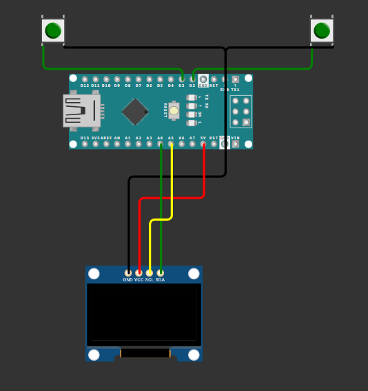

# IT4210-hệ nhúng game dino 

# GIỚI THIỆU:

- game dino là trò chơi mà khi bạn bấm nút thì sẽ giúp dino vượt qua chướng ngại vật

# HƯỚNG DẪN SỬ DỤNG:

- đầu tiên, cần chuẩn bị đầy đủ phần cứng, sau đó tải arduino ide và ch340 driver 
- khởi động IDE, trong Tools ở thanh công cụ, lần lượt chọn theo thứ tự (board->arduino avr board->arduino nano) (PORT->COM4) (processer->atmega328p hoặc oldbootloader nếu nạp code bị treo) (programmer->avrisp mkll)
- ở thanh công cụ, chọn file-> example-> adafruitssd1306-> ssd1306 128x64 i2c
- thay code mẫu bằng code đã clone ở dự án và nạp code 
- trò chơi hiển thị trên màn hình OLED, nút bấm kết nối với chân d3 là nút khởi động còn nút bấm kết nối với chân d2 là để điều khiển dino.
# DANH SÁCH LINH KIỆN

- màn hình OLED I2C 0.96
- kit arduino nano
- 2 button 
- dây nối, dây micro USB và breadboard 

# SƠ ĐỒ NGUYÊN LÝ 

    +-----------------+        +-----------------+
    |                 |        |                 |
    |                 |        |                 |
    |    Arduino      <--------> D2 (BTN1)       |
    |                 |        |                 |
    |                 |        |                 |
    |                 |        +-----------------+
    |                 |    
    |                 |        +-----------------+
    |                 |        |                 |
    |                 <--------> D3 (BTN2)       |
    |                 |        |                 |
    |                 |        |                 |
    +-----------------+        +-----------------+
                             |
                             |
                             |    
                       +--------------+
                       | Màn hình    |
                       | OLED         |
                       +--------------+

- kit gửi tín hiệu đến nút để kiểm tra xem nút có bị bấm hay không, sau đó thông tin truyền lại mạch để xử lý 
- màn hình được kết nối với kit qua giao tiếp i2c để nhận và gửi lại thông tin 
# THIẾT KẾ PHẦN MỀM

- Trò chơi hoạt động dựa vào 2 nút bấm, một nút là dùng để khởi động và một nút dùng để điều khiển dino vượt chướng ngại vật.
- Trạng thái nút bấm được kiểm tra bằng cơ chế polling , liên tục kiểm tra trạng thái ở chân nút. Trong hàm play(), sau mỗi lần vẽ lại màn hình, code kiểm tra trạng thái của nút bấm bằng digitalRead(JUMP_BUTTON_PIN), nếu phát hiện nút nhấn (trạng thái LOW), thực hiện hành động nhảy của dino.
- khi nhận được tín hiệu từ nút bấm, dino nhảy lên cao, tương ứng mức 30 điểm ảnh trên màn OLED, số đó được định nghĩa ở #define JUMP_PIXEL 30, hành động nhảy này được xử lý trong hàm play() với for(;; ) là vòng lặp chính
- hành động va chạm của dino cũng được xử lý trong vòng lặp for(;; ), Nếu khoảng cách giữa tree_x và DINO_INIT_X + DINO_WIDTH (phần cuối của dino) nhỏ hơn hoặc bằng một ngưỡng nào đó (ở đây là DINO_INIT_X + (DINO_WIDTH / 2)), và dino_y gần với DINO_INIT_Y - 3 (thiết lập ngưỡng phù hợp), thì xảy ra va chạm.
- Điểm số được tính bằng cách tăng biến score mỗi khi dino nhảy qua một cây (jump = 2 và dino_y đạt DINO_INIT_Y`)
- Trong mỗi lần lặp, các cây và dino được di chuyển sang trái (tree_x--, tree1_x--) và sau đó được vẽ lại trên màn hình.
- Khi xảy ra va chạm, vòng lặp dừng lại, và hàm gameOver(score) được gọi để hiển thị điểm số và lựa chọn chơi lại.
# TÁC GIẢ 

Phạm Hải Nam - 20215098
Nguyễn Trung Sơn - 20215132
Hoàng Văn Quang - 20215124

Dear [Karan-nevage],

Thank you for sharing [T-rex-Game-Arduino-Nano] on GitHub. It has been immensely helpful in shaping my ideas. Your contribution is greatly appreciated!

Best regards,
[Nam-haohanvn1]

